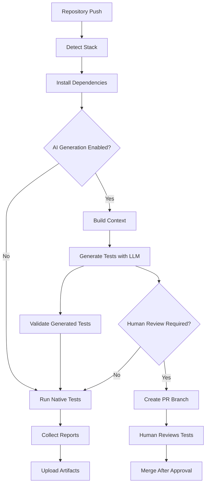

# GenAI Test Platform v2.0 - Production Ready

**One script, all stacks. AI-powered testing with human oversight.**

A production-ready, stack-agnostic AI testing platform that can be deployed to any repository with minimal setup. Supports Python, Node.js, and Java projects with comprehensive safety guardrails and human-in-the-loop validation.

## 🚀 Quick Start

### Option 1: Single Command Setup
Add this workflow to any repository:

```yaml
name: GenAI Test Platform
on: [push, pull_request]
jobs:
  test:
    runs-on: ubuntu-latest
    steps:
      - uses: actions/checkout@v4
      - uses: actions/setup-python@v5
        with:
          python-version: "3.10"
      - name: Run GenAI Test Platform
        run: |
          curl -L https://raw.githubusercontent.com/imcalledgautam/genai-test-platform/main/tools/genai_test_runner.py -o runner.py
          python runner.py
      - uses: actions/upload-artifact@v4
        with:
          name: test-results
          path: genai_artifacts/
```

### Option 2: Copy Complete Workflow
Use our pre-built workflow: [genai-unified-runner.yml](.github/workflows/genai-unified-runner.yml)

## 🏗️ Architecture Overview

### Core Components

1. **`genai_test_runner.py`** - Universal test runner that detects stack, installs deps, generates tests, runs them, and aggregates results
2. **`context_builder.py`** - Extracts repository facts to prevent AI hallucination  
3. **`policy_checker.py`** - Validates generated tests for security and quality
4. **`training_examples/`** - Curated good/bad test patterns for few-shot prompting
5. **HITL workflows** - Human-in-the-loop review system with automated PR creation

### Execution Flow



## 🎯 Key Features

### Universal Stack Support
- **Python**: pytest, unittest, coverage.py
- **Node.js**: Jest, Mocha, npm test
- **Java**: JUnit, TestNG, Maven/Gradle

### AI-Powered Test Generation
- **LLM Integration**: Ollama + Qwen2.5-Coder for local/CI generation
- **Context Awareness**: Analyzes existing code to generate relevant tests
- **Few-Shot Learning**: Uses curated examples for better output quality

### Safety & Security
- **Policy Enforcement**: Blocks dangerous patterns (sleep, network calls, eval)
- **Static Validation**: Syntax and compilation checks
- **Sandbox Execution**: Safe test execution with resource limits
- **Human Oversight**: Required approval for AI-generated tests

### Quality Assurance  
- **Anti-Pattern Detection**: Identifies flaky, non-deterministic tests
- **Quality Scoring**: Automated assessment of test quality (0.0-1.0)
- **Best Practice Enforcement**: AAA structure, clear assertions, proper naming

## 📋 What the LLM Needs (Input Specification)

For accurate test generation without hallucination, provide:

### A. Code & Configuration
```json
{
  "repository_manifest": {
    "total_files": 150,
    "files": [{"path": "src/calc.py", "size": 1024}],
    "config_files": ["requirements.txt", "pytest.ini"]
  },
  "public_surface": [
    {"type": "function", "name": "add", "file": "src/calc.py", "args": ["a", "b"]}
  ],
  "dependencies": ["pytest", "requests", "numpy==1.21.0"]
}
```

### B. Behavioral Specs  
- Function docstrings and type hints
- API contracts (OpenAPI, GraphQL schemas)
- Domain invariants ("totals must balance")
- Error handling expectations

### C. Execution Constraints
- Commands: `pytest -v --cov=src/`
- Allowed mocks: `requests`, `datetime`, `random`
- Forbidden: `sleep()`, real network calls, file system writes

### D. Test Expectations
- Coverage goals: critical paths ≥ 80%
- Patterns: AAA structure, descriptive names
- Framework: pytest fixtures, parametrized tests

### E. Quality Examples (Few-Shot)
```python
# Good example
def test_add_positive_numbers():
    # Arrange
    a, b = 5, 3
    # Act  
    result = add(a, b)
    # Assert
    assert result == 8

# Bad example (don't generate)
def test_add_with_sleep():
    time.sleep(0.1)  # ❌ Forbidden
    assert add(5, 3)  # ❌ Vague assertion
```

## 🛡️ Guardrails & Validation

### Policy Enforcement
- **Forbidden Patterns**: `sleep()`, `eval()`, subprocess, network calls
- **Required Patterns**: Assertions, test functions, proper naming
- **Security Checks**: No code injection, file system access, or privileged operations

### Quality Metrics
```python
quality_score = (
    descriptive_names * 0.2 +
    proper_assertions * 0.3 + 
    error_handling * 0.2 +
    edge_cases * 0.2 +
    documentation * 0.1
)
```

### Validation Pipeline
1. **Syntax Check**: AST parsing for Python, Node.js compilation check
2. **Policy Check**: Regex-based forbidden pattern detection  
3. **Quality Assessment**: Best practice compliance scoring
4. **Execution Safety**: Sandbox import and collection testing

## 👥 Human-in-the-Loop (HITL)

### Automated PR Creation
When AI generates tests, the system:
1. Creates branch `genai/tests-YYYYMMDD-HHMMSS`
2. Commits generated tests + validation reports
3. Opens PR with comprehensive review checklist
4. Requires human approval before merge

### Review Checklist
- **Functional**: Tests actually verify intended behavior
- **Quality**: Clear names, AAA structure, specific assertions
- **Safety**: No sleep, network calls, or non-deterministic patterns  
- **Technical**: Valid imports, proper mocking, framework compliance

### PR Template
Our [PR template](.github/pull_request_template_genai.md) provides:
- Structured review checklist
- Validation results summary
- Local testing instructions
- Security and quality guidelines

## 📊 Training & Fine-Tuning

### Dataset Structure
```
training_examples/
  python/
    good/
      calc_sum_test.py.ex1     # ✅ Proper AAA, edge cases
      api_routes_test.py.ex2   # ✅ Mocking, HTTP testing
    bad/  
      flaky_sleep_test.py.ex1  # ❌ Uses sleep, vague assertions
      brittle_mocks.py.ex2     # ❌ Shared state, order dependency
```

### Metadata Schema
```json
{
  "file": "calc_sum_test.py.ex1",
  "category": "good",
  "language": "python",
  "principles": ["deterministic", "isolated", "AAA"],
  "violations": [],
  "learning_points": ["Clear test naming", "Comprehensive edge cases"]
}
```

## 📈 Deployment Options

### 1. Individual Repository
Copy workflow file to `.github/workflows/genai-tests.yml`

### 2. Organization-Wide (GitHub Actions)
Use our [reusable action](.github/actions/genai-test-generator/action.yml):
```yaml
- uses: imcalledgautam/genai-test-platform/.github/actions/genai-test-generator@main
  with:
    stack: python
    enable-llm: true
```

### 3. Organization Template  
Add to organization `.github` repository for automatic inheritance

### 4. Centralized Service
Deploy webhook service that monitors all repositories:
```bash
python centralized-service.py --github-token $TOKEN --org myorg
```

## 🔧 Configuration

### Environment Variables
- `GENAI_ENABLE`: Enable/disable AI generation (`true`/`false`)
- `OLLAMA_MODEL`: LLM model to use (`qwen2.5-coder:1.5b`)
- `GENAI_TIMEOUT`: Generation timeout in seconds (`1800`)

### Stack-Specific Config
- **Python**: Automatically detects pytest/unittest, requirements.txt
- **Node.js**: Uses package.json scripts, supports Jest/Mocha  
- **Java**: Maven/Gradle detection, JUnit/TestNG support

### Quality Thresholds
```json
{
  "min_quality_score": 0.7,
  "require_edge_cases": true,
  "enforce_aaa_structure": true,
  "block_on_security_violations": true
}
```

## 📋 Usage Examples

### Basic Usage
```bash
# Run on any repository
python tools/genai_test_runner.py

# Disable AI generation
python tools/genai_test_runner.py --no-llm

# Override stack detection  
python tools/genai_test_runner.py --stack python
```

### Validation Only
```bash
# Check existing tests
python tools/policy_checker.py tests/ --stack python

# Generate quality report
python tools/policy_checker.py tests/ --output quality_report.json
```

### Context Analysis
```bash
# Build repository context
python tools/context_builder.py

# Custom output location
python tools/context_builder.py --output /tmp/context.json
```

## 🚀 Roadmap

- [ ] **GitHub App**: One-click installation across organizations
- [ ] **Web Dashboard**: Central monitoring and control panel
- [ ] **Multi-LLM Support**: OpenAI, Anthropic, local models
- [ ] **Advanced Metrics**: Test effectiveness scoring, regression detection
- [ ] **IDE Integration**: VS Code extension for local test generation

## 🤝 Contributing

1. **Add Training Examples**: Submit good/bad test patterns with metadata
2. **Improve Validation**: Enhance policy checking for specific frameworks
3. **Language Support**: Add new programming language detection and validation
4. **LLM Integration**: Add support for additional AI models

## 📄 License

MIT License - see [LICENSE](LICENSE) for details.

---

**GenAI Test Platform v2.0** - Bringing AI-powered testing to every repository with enterprise-grade safety and human oversight.